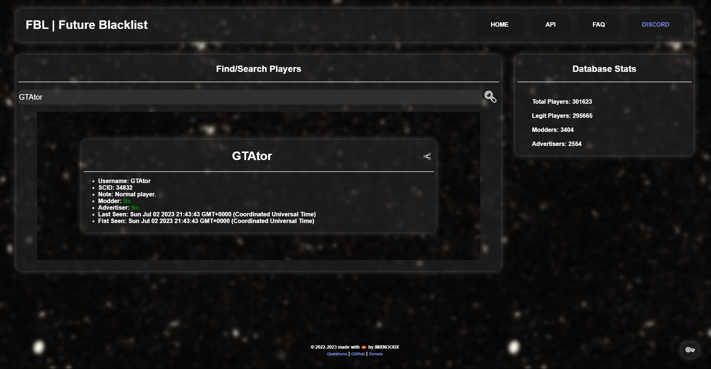

# 🌀 FutureBlacklist

> *Gta5 automated modder blacklist with rest api to dynamically add new modders*

This was my first big project, I started to learn more and to automate the process of adding modders to my blacklist. After some time I decided to make it in nodejs as python was not the best choice for this project. 

## 📦 Project Structure

- `data/`: Contains a database dump of all the players detected by the project through 3 years.
- `discord-bot/`: Contains the discord bot that was used to manage the blacklist. [*using this template*](https://github.com/IMXNOOBX/discord.bot)
- `scripts/`: Contains the scripts for different mods, there is a developer script that can be used to add modders to the blacklist & the public one that can only read data.
- `server/`: Contains the rest api server & website that was used to add modders to the blacklist.

> [!NOTE]
> The data dump can be found here [`./data/README.md`](./data/README.md)

## 📍 Note

> This project was made a long time ago by a noob from a long time ago, the code has really bad practices from which i have learned a lot. This project was made for fun and to learn how to make a full stack project. It was never used in any harmfull ways nor it has interfered with any other players. 
